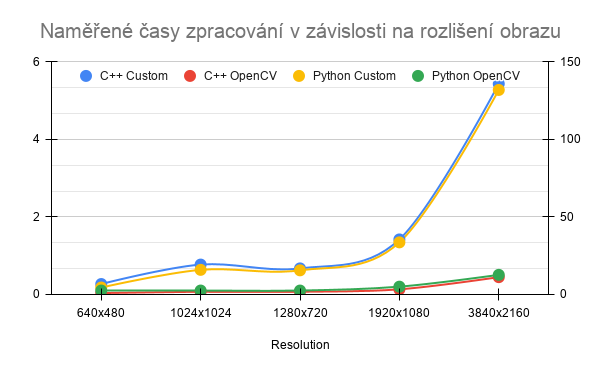

Segmentace je technika v oblasti počítačového vidění, která má za úkol vstupní obraz rozčlenit do menších částí tzv. segmetnů, které odpovádají jednotlivým objektům nebo oblastem, a které mají společné vlastnosti jako je zejména barva, jas nebo textura. Díky tomu lze obraz lépe analyzovat a pochopit jeho obsah na vyšší úrovni než jen na úrovni jednotlivých pixelů. Segmentaci potom používáme v následujících případech:

- Zjednodušení analýzy obrazu
	- Místo práce s miliony pixelů pracujeme s menším počtem segmentů, což výrazně zjednodušuje další zpracování.
- Detekce a rozpoznání objektů
	- Segmentace umožňuje oddělit objekty od pozadí, což je klíčové například pro rozpoznávání obličejů, aut nebo jiných prvků v obraze.
- Přesnější měření a analýza  
	- Umožňuje měřit vlastnosti konkrétních objektů (velikost, tvar, poloha), což je důležité třeba v medicíně nebo průmyslové kontrole kvality.
- Příprava pro další algoritmy
	- Segmentovaný obraz slouží jako vstup pro další metody, jako je klasifikace nebo sledování objektů.
- Zvýšení efektivity výpočtů  
	- Zpracování menšího množství relevantních dat vede k rychlejším a efektivnějším algoritmům.

Cílem této semestrální práce bylo přepsání původní práce napsané v jazyce Python do jazyka C++, porovnání rychlosti zpracování obrazu při různých rozlišeních a zpracování analýzy výsledků.

---

# Watershed segmentace

Watershed segmentace je metoda z oblasti zpracování obrazu, která vychází z analogie s topografickým reliéfem. Obraz je interpretován jako krajina, kde intenzita pixelů odpovídá nadmořské výšce – světlé oblasti představují vrcholy a tmavé oblasti údolí. Algoritmus si lze představit jako postupné zaplavování této krajiny vodou: voda začíná proudit z lokálních minim (nejnižších bodů) a postupně zaplavuje okolní oblasti. Jakmile se voda z různých zdrojů setká, vytvoří se mezi nimi hranice zvané „watershed linie“, které oddělují jednotlivé segmenty. Výsledkem je rozdělení obrazu na oblasti odpovídající jednotlivým „povodím“.

Tato metoda je velmi citlivá na šum, a proto se v této semestrální práci využívá předzpracování obrazu pomocí Gaussian blur pro jeho vyhlazení a dále morfologických operací realizovaných funkcí MorphologyEx, které pomáhají odstranit drobné artefakty a zpřesnit oblasti objektů.

Následně se využívají tzv. **markery** určující počáteční body zaplavování, přičemž obecně existují dva přístupy k jejich volbě – buď jsou určeny uživatelem přímo v obraze, nebo jsou automaticky získány jako lokální minima. V této práci je použit automatický přístup založený na hledání lokálních minim, přičemž uživatel může v grafickém rozhraní určit jejich počet v rozsahu 2–253. Horní hranice je dána implementačním omezením, kdy se pracuje s odstíny šedi reprezentovanými datovým typem `uint8`, takže hodnoty 0 a 1 jsou rezervovány pro speciální účely (0 pro neprozkoumané pixely a 1 pro watershed linie), což ponechává maximálně 253 hodnot pro jednotlivé segmenty.

## Meyer watershed algoritmus

Meyerův watershed algoritmus je implementačně založen na prioritní frontě, která zajišťuje, že pixely jsou zpracovávány v pořadí odpovídajícím jejich intenzitě, což simuluje proces postupného zaplavování .

```
INPUT:
    img_mat
    gauss_kernel
    morp_kernel
    max_markers

# 1. Preprocessing
gray_img ← PREPROCESS(img_mat, gauss_kernel, morp_kernel)

# 2. Find local minima (markers)
local_mins ← FIND_LOCAL_MINIMA(gray_img, max_markers)

# 3. Initialization
markers ← matrix of same size as gray_img, filled with 0
marker_id ← 1
queue ← empty priority queue

# 4. Set initial markers and initialize queue
FOR each (i, j) in local_mins DO:
    markers[i, j] ← marker_id

    FOR each neighbor (ni, nj) of (i, j) DO:
        IF markers[ni, nj] == 0 THEN:
            PUSH(queue, (gray_img[ni, nj], ni, nj))

    marker_id ← marker_id + 1

# 5. Watershed flooding process
WHILE queue is not empty DO:
    (_, row, col) ← POP_MIN(queue)

    IF markers[row, col] ≠ 0 THEN:
        CONTINUE

    neighbor_labels ← empty list

    FOR each neighbor (ni, nj) of (row, col) DO:
        IF markers[ni, nj] > 0 THEN:
            ADD markers[ni, nj] to neighbor_labels

    unique_labels ← SET(neighbor_labels)

    IF SIZE(unique_labels) == 1 THEN:
        markers[row, col] ← only element in unique_labels

        FOR each neighbor (ni, nj) of (row, col) DO:
            IF markers[ni, nj] == 0 THEN:
                PUSH(queue, (gray_img[ni, nj], ni, nj))

    ELSE IF SIZE(unique_labels) > 1 THEN:
        markers[row, col] ← -1   # watershed boundary

# 6. Visualization
gray_base ← convert img_mat to grayscale
view_img ← replicate gray_base into 3 channels (RGB)

FOR each pixel (i, j):
    IF markers[i, j] == -1 THEN:
        view_img[i, j] ← (255, 0, 0)

# 7. Output
RETURN markers, view_img
```

---

# Instalační příručka pro C++

Tato část popisuje instalaci systémových závislostí, sestavení a spuštění C++ implementace projektu.

## 1. Instalace systémových závislostí

Projekt obsahuje skript `install-dependacies.sh`, který instaluje balíčky potřebné pro sestavení aplikace na distribucích založených na Debianu nebo Ubuntu.

Skript instaluje zejména:

- základní nástroje pro překlad C++ projektu (`build-essential`, `cmake`, `git`),
- nástroj `pkg-config`, který CMake používá pro nalezení GTK,
- knihovnu OpenCV (`libopencv-dev`),
- knihovnu GTK3 (`libgtk-3-dev`),
- OpenGL vývojové balíčky (`libgl1-mesa-dev`),
- systémové závislosti potřebné pro sestavení SFML ze zdrojových kódů.

Skript lze spustit příkazem:

```bash
./install-dependacies.sh
```

Poznámka: Knihovny SFML, ImGui, ImGui-SFML a nativefiledialog nejsou instalovány jako systémové balíčky. Projekt je stahuje automaticky pomocí `FetchContent` v souboru `CMakeLists.txt`. Instalační skript proto instaluje pouze systémové balíčky, které jsou potřeba pro jejich sestavení a linkování.

## 2. Sestavení projektu

Pro sestavení C++ aplikace slouží skript `build.sh`.

Skript provede tyto kroky:

- spustí instalaci závislostí pomocí `install-dependacies.sh`,
- vytvoří složku `build`,
- přejde do složky `build`,
- spustí konfiguraci projektu pomocí `cmake ..`,
- sestaví projekt příkazem `make`,
- přesune výsledný spustitelný soubor `watershed_app` do kořenové složky projektu.

Sestavení lze spustit příkazem:

```bash
./build.sh
```

Po úspěšném sestavení je možné aplikaci spustit příkazem:

```bash
./watershed_app
```

# Instlační příručka pro Python

Tato část popisuje instalaci systémových závislostí, vytvoření virtuálního prostředí a instalaci Python balíčků potřebných pro spuštění původní Python implementace projektu.

## 1. Instalace závislostí

Nejprve je potřeba nainstalovat systémovou závislost pro knihovnu `tkinter`, která se používá pro výběr souborů v grafickém rozhraní:

```bash
sudo apt install python3-tk
```

V kořenové složce projektu vytvořte Python virtuální prostředí:

```bash
python3 -m venv .
```

Poté virtuální prostředí aktivujte:

```bash
source bin/activate
```

Poznámka: Tento příkaz platí pro shell `bash`. Pokud používáte jiný shell, je potřeba zvolit odpovídající aktivační skript pro daný shell.

Po aktivaci virtuálního prostředí nainstalujte všechny potřebné Python balíčky ze souboru `requirements.txt`:

```bash
pip install -r requirements.txt
```

## 2. Spuštění aplikace

Po dokončení instalace a aktivaci virtuálního prostředí lze Python implementaci spustit příkazem:

```bash
python src/main.py
```

---

# Uživatelská příručka

Tato kapitola slouží jako kompletní průvodce pro instalaci, konfiguraci a následné spuštění aplikace. Detailně popisuje ovládací prvky uživatelského rozhraní a specifika navigace v obou implementacích (C++ i Python), čímž uživateli usnadňuje efektivní využití všech funkcí pro watershed segmentaci.

## 1. První kroky a načtení obrazu

Po spuštění aplikace (ať už v C++ nebo Pythonu) je prvním krokem načtení dat prostřednictvím ovládacího panelu:
- **Tlačítko "Load Image":** Vyvolá systémové okno pro výběr souboru. Podporovány jsou standardní formáty (PNG, JPG, BMP).
- **Zobrazení:** Po úspěšném načtení se otevře okno s originálním náhledem obrázku.

## 2. Konfigurace parametrů segmentace

Uživatelské rozhraní nabízí dvě sekce nastavení – jednu pro vlastní implementaci a druhou pro knihovnu OpenCV. Parametry můžete měnit pomocí posuvníků (sliderů) v reálném čase:

|**Parametr**|**Funkce**|**Doporučení**|
|---|---|---|
|**Markers**|Nastavuje počet startovních bodů (semen) pro zaplavování.|Vyšší počet markerů odhalí více detailů, ale může způsobit pře-segmentaci.|
|**Gauss Blur Kernel**|Definuje úroveň rozostření pro redukci šumu před výpočtem.|Pro zašuměné obrázky použijte vyšší hodnotu (např. 7 nebo 9).|
|**Morphology Kernel**|Určuje velikost strukturního elementu pro výpočet hran.|Ovlivňuje robustnost detekovaných linií watershed.|

## 3. Spuštění a zpracování

Výpočet spustíte tlačítky **"Run Custom Watershed"** nebo **"Run OpenCV Watershed"**.

**1.Výpočet na pozadí:** Asynchronní zpracování.

Aplikace spustí algoritmus v samostatném vlákně. Díky tomu uživatelské rozhraní nezamrzne.

**2.Zobrazení výsledků:** Nové okno se segmentací.

Po dokončení se automaticky otevře okno **"Segmented Image"**. Detekované hranice jsou vykresleny kontrastní barvou na černobílém podkladu.

**3.Uložení statistik:** Složka statistics.

Informace o rozlišení obrazu a době trvání výpočtu jsou automaticky zapsány do CSV souboru pro pozdější analýzu výkonu.

---

> **Upozornění k navigaci:** Pokud během práce zavřete okno s originálním obrázkem, aplikace uvolní paměť a pro další výpočet bude nutné obrázek načíst znovu.

---

# Implementace

V této kapitole je detailně rozebrána technická realizace obou řešení. Pozornost je věnována jak nízkoúrovňové implementaci v jazyce **C++**, tak skriptovací variantě v **Pythonu**. U obou přístupů je popsána adresářová struktura projektu, klíčové moduly a stěžejní funkce. Kapitola rovněž obsahuje přehled generovaných výstupů a způsob jejich interpretace.

## Python

Tato podkapitola je věnovaná implementaci segmentace v Pythonu.

### Adresářová struktura

```
├── src
│   ├── controller
│   │   └── Controller.py        # Propojení mezi GUI a logikou (Service)
│   ├── main.py                  # Vstupní bod aplikace
│   ├── service
│   │   ├── ImageLoader.py       # Správa načítání a ukládání obrazových dat
│   │   └── ImageService.py      # Implementace Meyerova algoritmu a volání OpenCV
│   └── window
│       ├── App.py               # Hlavní okno aplikace (definice GUI)
│       ├── OriginalImage.py     # Komponenta pro zobrazení vstupního obrazu
│       └── SegmentedImage.py    # Komponenta pro zobrazení výsledků segmentace
└── statistics
    └── segmentation_runtime_python20260423212101.csv  # Naměřená data výkonu
```

### Modul `Controller.py`

Tato třída implementuje vzor Controller a zajišťuje orchestraci celé aplikace. Spravuje stav uživatelského rozhraní, načítání souborů a asynchronní spouštění výpočetních úloh.

**Klíčové funkce:**

- `load_image()`: Obsluhuje dialogové okno pro výběr souboru a využívá `ImageLoader` k načtení dat do matice `numpy`. Následně inicializuje okno s originálním náhledem.
- `run_custom_watershed()` / `run_cv_watershed()`: Tyto metody spouští proces segmentace. Klíčovým prvkem je použití `threading.Thread`, díky čemuž výpočet probíhá v samostatném vlákně a neblokuje (teoreticky) hlavní smyčku GUI.
- `_display_result()`: Metoda, která v pravidelných intervalech kontroluje frontu (`queue.Queue`). Jakmile výpočetní vlákno dokončí práci, tato funkce převezme výsledek, vypočítá celkový čas běhu a aktualizuje zobrazení v okně `SegmentedImage`.
- `_write_time()`: Zajišťuje perzistenci naměřených dat ukládáním statistik (metoda, rozlišení, čas) do CSV souboru ve složce `statistics`.

### Modul `ImageService.py`

Tento modul tvoří výpočetní jádro aplikace. Obsahuje jak nízkoúrovňovou implementaci Meyerova algoritmu, tak obalovou funkci pro volání knihovny OpenCV.

**Klíčové funkce:**

- `_find_local_mins()`: Pomocná funkce, která pomocí logických operací nad maticemi `numpy` detekuje lokální minima v gradientu obrazu. Tato minima slouží jako automaticky generované markery (semena) pro zaplavování.
- `_preprocess_for_custom_watershed()`: Provádí nezbytnou transformaci vstupního obrazu. Zahrnuje převod na stupně šedi, aplikaci Gaussova rozostření pro redukci šumu a výpočet morfologického gradientu, který zvýrazňuje hrany objektů.
- `watershed()`: **Vlastní implementace Meyerova algoritmu.** Využívá prioritní frontu implementovanou pomocí modulu `heapq`. Algoritmus simuluje zaplavování z markerů, přičemž pixely s nejnižší intenzitou gradientu mají prioritu. Pokud se v jednom bodě setkají dvě různé "vody" (markery), je tento pixel označen jako hranice (-1).
- `cv_watershed()`: Implementace využívající funkci `cv2.watershed`. Na rozdíl od vlastní verze vyžaduje tato funkce specifickou přípravu markerů do 32-bitové matice a pracuje přímo nad vysoce optimalizovaným C++ jádrem OpenCV.

### Adresář `statistics`

Tento adresář slouží k automatickému ukládání naměřených dat o výkonu aplikace. Systém je navržen tak, aby umožňoval následnou analýzu škálování algoritmů v závislosti na rozlišení obrazu.

- **Generování souborů:** Při každém spuštění aplikace se v tomto adresáři vytvoří unikátní soubor s časovým razítkem v názvu (např. `segmentation_runtime_python20260423212101.csv`).
- **Formát dat:** Výsledky jsou ukládány ve formátu CSV (Comma-Separated Values) pro snadný import do analytických nástrojů.
- **Struktura záznamu:** Každý řádek v souboru obsahuje následující metadata o proběhlém výpočtu:
    - `watershed_method`: Identifikátor použité metody (vlastní Meyer vs. OpenCV).
    - `image_resolution`: Rozlišení zpracovávaného obrazu (např. 3840×2160).
    - `time_to_run`: Čas výpočtu v sekundách zaokrouhlený na čtyři desetinná místa.

## C++

### Adresářová struktura

```
├── CMakeLists.txt              # Konfigurace projektu a linkování OpenCV
├── include                     # Hlavičkové soubory (deklarace tříd a metod)
│   ├── controller
│   │   └── Controller.hpp      # Definice rozhraní pro řízení toku aplikace
│   ├── model
│   │   └── ImageData.hpp       # Datový model pro uchovávání matic obrazu
│   └── service
│       ├── image_loader.hpp    # Deklarace metod pro načítání souborů
│       └── image_service.hpp   # Deklarace Meyerova algoritmu a OpenCV wrapperu
├── src                         # Zdrojové soubory (implementace logiky)
│   ├── controller
│   │   └── Controller.cpp      # Implementace obsluhy událostí a vláken
│   ├── Main.cpp                # Vstupní bod aplikace
│   ├── model
│   │   └── ImageData.cpp       # Implementace metod datového modelu
│   └── service
│       ├── image_loader.cpp    # Implementace nízkoúrovňového načítání
│       └── image_service.cpp   # Jádro algoritmu s prioritní frontou (STL)
```

### Modul `image_service` (Service)

Tento jmenný prostor (namespace) obsahuje čistou logiku zpracování obrazu. Na rozdíl od Pythonu využívá C++ verzi standardní knihovny pro prioritní frontu (`std::priority_queue`), což zajišťuje výrazně vyšší efektivitu při řazení pixelů podle intenzity.

**Klíčové funkce:**

- **`watershedSegmentation()`**: Vlastní implementace Meyerova algoritmu. Využívá strukturu `Pixel` a prioritní frontu k postupnému "zaplavování" obrazu z definovaných markerů. Pixelům, kde se setkají různé oblasti, přiřazuje hodnotu `-1` (hranice).
- **`cvWatershedSegmentation()`**: Wrapper nad funkcí `cv::watershed`. Zahrnuje kompletní řetězec předzpracování: převod na stupně šedi, Gaussian blur pro potlačení šumu a výpočet morfologického gradientu pro zvýraznění hran.
- **`findLocalMins()`**: Interní funkce pro automatickou detekci počátečních bodů (semen) v gradientu obrazu, která simuluje lokální minima reliéfu.

### Třída `Controller` (Controller)

Třída `Controller` funguje jako mozek aplikace. Spravuje životní cyklus oken, zpracovává vstupy od uživatele přes ImGui a asynchronně spouští výpočty.

**Klíčové mechanismy:**

- **Asynchronní zpracování:** Pro zabránění zamrzání GUI využívá `std::async` a `std::future<cv::Mat>`. To umožňuje, aby výpočet běžel na pozadí, zatímco hlavní vlákno nadále obsluhuje vykreslování oken.
- **`renderGuiElements()`**: Definice ovládacího panelu. Obsahuje posuvníky (slidery) pro parametry algoritmu (počet markerů, velikost kernelu) a tlačítka pro spuštění segmentace.
- **`writeTime()`**: Zajišťuje zápis naměřených dat do CSV souboru. Loguje metodu, rozlišení a přesnou dobu trvání výpočtu pomocí `std::chrono`.

### Třída `ImageModel` (Model)

Tento modul slouží jako centrální úložiště pro obrazová data aplikace.

**Vlastnosti:**

- **Synchronizace dat:** Udržuje souběžně matice `cv::Mat` pro výpočty a textury `sf::Texture` pro zobrazení v SFML oknech.
- **`updateOriginalImage()` / `updateSegmentedImage()`**: Zajišťují bezpečné kopírování dat (pomocí `.clone()`) a aktualizaci grafických textur při změně rozlišení nebo obsahu obrazu.

### Adresář `statistics`

V C++ implementaci slouží tento adresář ke stejnému účelu jako v Pythonu — k automatickému logování výkonnostních metrik. Rozdíl spočívá v nízkoúrovňovém přístupu k měření času a práci se souborovým systémem.

- **Lokalizace:** Složka se vytváří relativně k umístění spustitelného souboru (`.exe` nebo binárka). Pokud složka neexistuje, aplikace se ji pokusí automaticky vytvořit pomocí knihovny `<filesystem>`.
    
- **Přesnost měření:** Na rozdíl od Pythonu využívá C++ modul `<chrono>` a jeho `high_resolution_clock`. To umožňuje měřit čas segmentace s mikrosekundovou přesností, což je klíčové pro zachycení velmi rychlých běhů optimalizovaného OpenCV.
    
- **Struktura CSV:** Soubor si zachovává identickou strukturu jako Python verze, což usnadňuje následné společné zpracování dat v grafech:
    - `watershed_method`: Typ algoritmu (např. "Custom" nebo "OpenCV").
    - `image_resolution`: Rozlišení (např. 1920x1080).
    - `time_to_run`: Čas v sekundách.

# Analýza a vyhodnocení výsledků

V této kapitole jsou analyzovány výsledky segmentace obrazu získané pomocí dvou přístupů – vlastní implementace Meyerova watershed algoritmu a knihovní funkce z OpenCV. Obě varianty využívají shodné předzpracování obrazu a zároveň společnou ručně implementovanou funkci pro detekci lokálních minim, která slouží jako jednotný základ pro inicializaci markerů. Jak již bylo uvedeno v úvodu dokumentace, všechny funkce byly implementovány jak v jazyce C++, tak i v Pythonu, což umožňuje ověřit konzistenci výsledků napříč oběma implementačními prostředími. Díky tomuto přístupu je možné objektivně porovnat samotné chování a výsledky obou implementací při zachování stejného vstupního základu.

## Porovnání výkonu a škálování

Hlavním zjištěním je propastný rozdíl v absolutních časech zpracování. Zatímco v **C++** trvá segmentace obrazu v rozlišení 4K (3840×2160) přibližně **5,5 sekundy**, identický algoritmus v **Pythonu** vyžaduje pro stejná data více než **130 sekund**. Tento nárůst je dán především režií interpretovaného jazyka při práci s prioritní frontou a iterací přes jednotlivé pixely, což jsou operace, které C++ zvládá díky přímému přístupu k paměti a efektivní kompilaci řádově rychleji. U obou jazyků je patrné, že s přechodem z Full HD na 4K rozlišení (čtyřnásobný počet pixelů) roste časová náročnost nelineárně, což potvrzuje výpočetní komplexitu watershed transformace.

## Vlastní algoritmus vs. OpenCV a odezva GUI

Druhým klíčovým aspektem je srovnání s knihovní funkcí `opencv_watershed`. Knihovna OpenCV vykazuje v obou prostředích excelentní a téměř identické výsledky (v řádu zlomků sekund i pro 4K), což je způsobeno tím, že Python v tomto případě pouze volá vysoce optimalizované C++ jádro knihovny.

Důležitým poznatkem z testování je chování uživatelského rozhraní (GUI) během výpočtu. Ačkoliv je v obou implementacích zpracování obrazu odděleno do samostatného vlákna, v **Pythonu** dochází kvůli mechanismu **Global Interpreter Lock (GIL)** k boji o interpret mezi výpočetním vláknem a vláknem obsluhujícím GUI. Výsledkem je, že při náročném výpočtu (zejména u 4K rozlišení) se aplikace v Pythonu jeví jako **neodpovídající**, zatímco v C++ zůstává rozhraní plně plynulé. Vlastní implementace v Pythonu se tak pro vysoká rozlišení stává prakticky nepoužitelnou, což jasně ilustruje nutnost volby nízkoúrovňových jazyků pro výpočetně náročné úlohy počítačového vidění.

## Naměřené hodnoty

Následující tabulka a grafy dokumentují propastný rozdíl mezi nativní implementací v C++ a skriptovacím jazykem Python při zpracování identických dat.

|**Resolution**|**C++ Custom**|**C++ OpenCV**|**Python Custom**|**Python OpenCV**|
|---|---|---|---|---|
|**640x480**|0.2689|0.0351|4.4668|0.1007|
|**1024x1024**|0.7706|0.0682|15.8742|0.1007|
|**1280x720**|0.6719|0.0692|15.5574|0.1004|
|**1920x1080**|1.4196|0.1322|33.5999|0.2007|
|**3840x2160**|5.4344|0.4464|131.9114|0.5057|

## Vizualizace škálování algoritmů

Následující graf názorně ilustruje, jak s rostoucím rozlišením (a tedy počtem pixelů) stoupá doba výpočtu. Vizualizace využívá dvě osy $y$ pro zachycení obrovského rozdílu v řádech mezi jednotlivými metodami: levá osa odpovídá výkonu C++ a optimalizovaného OpenCV, zatímco pravá osa (v rozsahu 0–150 sekund) reflektuje náročnost vlastní implementace v Pythonu.



### Klíčová pozorování z grafu:

- **Dominance Python Custom:** Žlutá křivka (Python Custom) vykazuje strmý, téměř exponenciální nárůst a při 4K rozlišení dosahuje hranice **132 sekund**.
- **Efektivita C++:** Modrá křivka (C++ Custom) sleduje podobný trend škálování, ale drží se v řádu jednotek sekund, konkrétně pod hranicí **6 sekund** pro nejvyšší rozlišení.
- **Stabilita OpenCV:** Zelená a červená křivka (OpenCV implementace) zůstávají u spodní hranice grafu s minimální režií, což potvrzuje efektivitu jejich nízkoúrovňových optimalizací bez ohledu na volbu volajícího jazyka.
---

# Závěr

Cílem této semestrální práce bylo implementovat Meyerův watershed algoritmus pro segmentaci obrazu v jazycích C++ a Python, provést jejich vzájemné srovnání a analyzovat výkonnostní rozdíly oproti optimalizovanému řešení v knihovně OpenCV.

Praktické testování na různých rozlišeních, od standardního 640×480 až po 4K rozlišení (3840×2160), jednoznačně potvrdilo kritický význam volby programovacího jazyka pro výpočetně náročné úlohy počítačového vidění. Hlavní přínosy a zjištění lze shrnout do následujících bodů:

1. **Výkonnostní propast:** Vlastní implementace v jazyce C++ prokázala až **25násobně vyšší rychlost** zpracování oproti identickému algoritmu v Pythonu. Zatímco v C++ je zpracování 4K obrazu otázkou několika sekund, v Pythonu se doba výpočtu šplhá přes dvě minuty.
2. **Efektivita prioritní fronty:** Měření ukázala, že režie interpretovaného jazyka (Python) při intenzivní manipulaci s prioritní frontou a miliony pixelů roste nelineárně. C++ díky přímé práci s pamětí a efektivním datovým strukturám standardní knihovny (STL) škáluje mnohem lépe.
3. **Vliv na uživatelské rozhraní:** Analýza odhalila zásadní problém s mechanismem Global Interpreter Lock (GIL) v Pythonu. I přes oddělení výpočtu do samostatného vlákna docházelo k zamrzání GUI, což v C++ implementaci díky skutečnému paralelismu zcela odpadá.
4. **Optimalizace knihovny OpenCV:** Srovnání ukázalo, že pro produkční nasazení je knihovní funkce `opencv_watershed` nepřekonatelná díky hlubokým optimalizacím. Vlastní implementace Meyerova algoritmu v C++ však posloužila jako vynikající nástroj pro pochopení vnitřních mechanismů segmentace a jako důkaz, že i ručně psaný kód v nízkoúrovňovém jazyce může být velmi efektivní.

Závěrem lze konstatovat, že stanovené cíle práce byly splněny. Implementace v C++ nejenže zajistila plynulý chod aplikace a rychlejší výpočty, ale také umožnila efektivní zpracování obrazových dat ve vysokém rozlišení, které bylo v původním prostředí Python prakticky nerealizovatelné.
